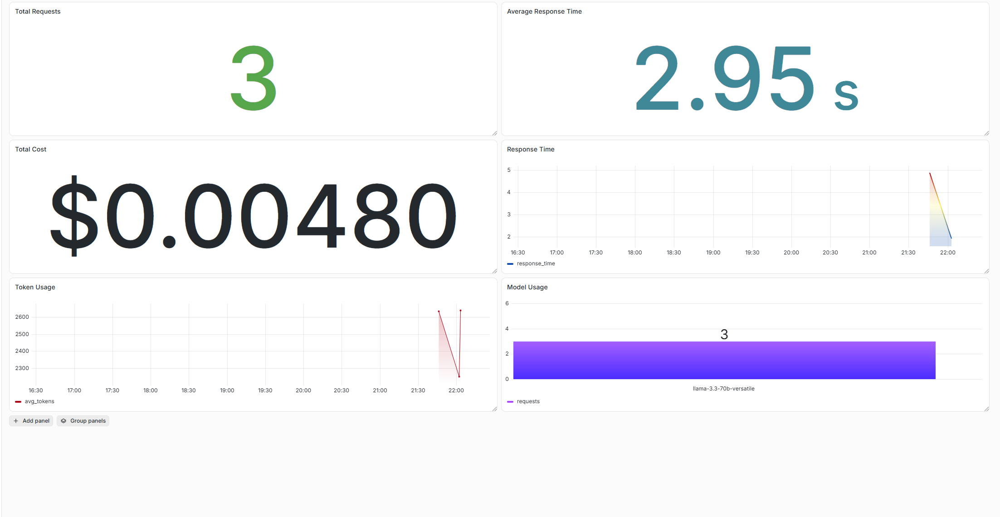

# 🌍 GeoAI Research Assistant

<p align="center">
  
</p>

<p align="center">
An end-to-end <b>Retrieval-Augmented Generation (RAG)</b> system for exploring <b>GeoAI</b>, <b>Earth Observation</b> and <b>Remote Sensing</b> research papers featuring hybrid retrieval, automated evaluation with <b>RAGAS</b>, <b>Dockerized</b> deployment, <b>PostgreSQL</b> request logging and <b>Grafana</b>-based monitoring.
</p>

<p align="center">


</p>

---

# 📖 Overview

GeoAI Research Assistant helps researchers, students and practitioners efficiently explore scientific literature without manually searching through hundreds of papers.

The system combines traditional information retrieval with semantic search and Large Language Models to generate grounded, context-aware answers from GeoAI research papers.

---

# ✨ Features

-  Hybrid Retrieval (SQLite FTS + Semantic Search)
-  Context Grounded Responses
-  Reciprocal Rank Fusion (RRF)
-  Topic-based Filtering
-  Interactive Streamlit Interface
-  Automated RAG Evaluation using RAGAS
-  Dockerized Deployment
-  PostgreSQL Request Logging
-  Grafana Monitoring Dashboard
-  End-to-End Containerized Architecture

---

# 📚 Research Topics

- GeoAI
- Earth Observation
- Remote Sensing
- Foundation Models
- Vision Transformers
- Self-Supervised Learning
- Sentinel-2
- Satellite Imagery
- Land Use Land Cover (LULC) Classification
- Change Detection

---

# 🏗️ System Architecture

```text
                User
                  │
                  ▼
          Streamlit Interface
                  │
                  ▼
        Hybrid Retrieval Engine
        ├──────────────┐
        ▼              ▼
 SQLite FTS5     Vector Search
        │              │
        └──────┬───────┘
               ▼
     Reciprocal Rank Fusion
               ▼
      Context Construction
               ▼
      Llama 3.3 70B (Groq)
               ▼
        Generated Response
               │
      ┌────────┴─────────┐
      ▼                  ▼
Streamlit UI      PostgreSQL Logging
                         │
                         ▼
                   Grafana Dashboard
```

---

# 💻 Application

Example Questions

```text
How are Vision Transformers used in Remote Sensing?

Compare CNNs and Vision Transformers for LULC classification.

What are Foundation Models for Earth Observation?

Explain Self-Supervised Learning in GeoAI.

What are recent trends in Change Detection?
```

---

# ⚙️ Tech Stack

## LLM

- Groq API
- Llama-3.3-70B-versatile for the final grounded answers
- all-MiniLM-L6-v2 for vector search embeddings

## Retrieval

- SQLite FTS5 (Full Text Search)
- Sentence Transformers
- Hybrid Search
- Reciprocal Rank Fusion (RRF)

## Frameworks

- Streamlit
- Python

## Deployment & Monitoring

- Docker
- PostgreSQL
- Grafana

## Evaluation

- Ragas
- Llama-3.1-8B-instant (LLM Judge)

---

# 📂 Dataset

The knowledge base was built by querying the [arXiv API](https://arxiv.org/help/api) across 13 topic-specific searches spanning GeoAI, Earth Observation, Remote Sensing, Vision Transformers and Foundation Models, sorted by most recent submission date. After collection, this indexes around **1,000 research papers**.

### Indexing Pipeline

The `build_index.py` script orchestrates the full ingestion-to-index flow:

1. **Ingesting** - `ingest.py` queries the arXiv API across the 13 topic searches and returns paper metadata (title, abstract, authors, year, topic, URL).
2. **Keyword index** - papers are added to a `TextSearchIndex` (SQLite FTS5), searchable on `title`, `authors` and `abstract`, with `topic` as a filterable keyword field. Saved to `geoai.db`.
3. **Vector index** - `build_embeddings.py` encodes the same documents into sentence-transformer embeddings for semantic search. Saved to `geoai_embeddings.pkl`.


Each document contains:

- Title
- Abstract
- Authors
- Publication Year
- Topic
- Source URL

---

# 📊 Evaluation Pipeline

```text
Research Papers
       │
       ▼
Automatic Question Generation
       │
       ▼
questions.json
       │
       ▼
Run RAG Pipeline
       │
       ▼
rag_outputs.json
       │
       ▼
Ragas Evaluation
       │
       ▼
Evaluation Metrics
```

The evaluation pipeline automatically:

- Generates evaluation questions from the indexed papers.
- Runs the complete RAG pipeline.
- Evaluates generated answers using Ragas.
- Produces quantitative evaluation reports.

---

# 📈 Evaluation Results

| Metric | Score |
|---------|------:|
| Faithfulness | **0.7386** |
| Answer Relevancy | **0.8267** |
| Context Precision | **0.8600** |

### Interpretation

- ✅ Responses remain well grounded in retrieved literature.
- ✅ High answer relevancy indicates the assistant answers user questions effectively.
- ✅ Hybrid retrieval consistently retrieves relevant scientific papers.

# 📊 Monitoring Dashboard

The application includes an end-to-end monitoring pipeline for tracking RAG usage and system behavior.

Every user query is automatically logged to PostgreSQL, enabling real-time visualization through Grafana.

### Logged Metrics

- User queries
- Retrieved document count
- Response latency
- Token usage
- Timestamp
- LLM model
- Retrieval metadata

This monitoring stack provides valuable insights into application usage, debugging and performance trends.

<p align="center">
  
</p>

---

# 🚀 Running Locally

Clone the repository

```bash
git clone https://github.com/Vaibhav170216/geoai-research-assistant.git

cd geoai-research-assistant
```

Install dependencies

```bash
uv sync
```

Create a `.env`

```text
GROQ_API_KEY=your_groq_api_key
```

Build the index

```bash
python build_index.py
```

Run the application

```bash
streamlit run app.py
```

Alternatively if you want to deplot whole application end-to-end then read the below instructions -

# Dockerized Deployment

## Prerequisites

Before running the project, ensure you have the following installed:

- Docker Desktop (with WSL2 enabled)
- Git
- Groq API Key

---

## Clone the Repository

```bash
git clone https://github.com/Vaibhav170216/geoai-research-assistant.git

cd geoai-research-assistant
```

---

## Configure Environment Variables

Create a `.env` file in the project root:

```text
GROQ_API_KEY=your_groq_api_key
```

---

## Build and Run

Build the Docker images and start all services:

```bash
docker compose up --build
```

The first build may take several minutes as dependencies are downloaded.

---

## Available Services

| Service | URL | Description |
|----------|-----|-------------|
| Streamlit App | http://localhost:8501 | GeoAI Research Assistant |
| Grafana Dashboard | http://localhost:3000 | Monitoring Dashboard |
| PostgreSQL | localhost:5432 | Request Logging Database |

---

## Stopping the Application

Stop all running containers:

```bash
docker compose down
```

To remove containers, networks, and volumes:

```bash
docker compose down -v
```

> **Warning:** Using `docker compose down -v` permanently deletes the PostgreSQL database and Grafana data.

---

# 🔮 Future Improvements

- PDF Parsing Pipeline
- Agentic Literature Review

---

# 👨‍💻 Author

**Vaibhav Nagar**